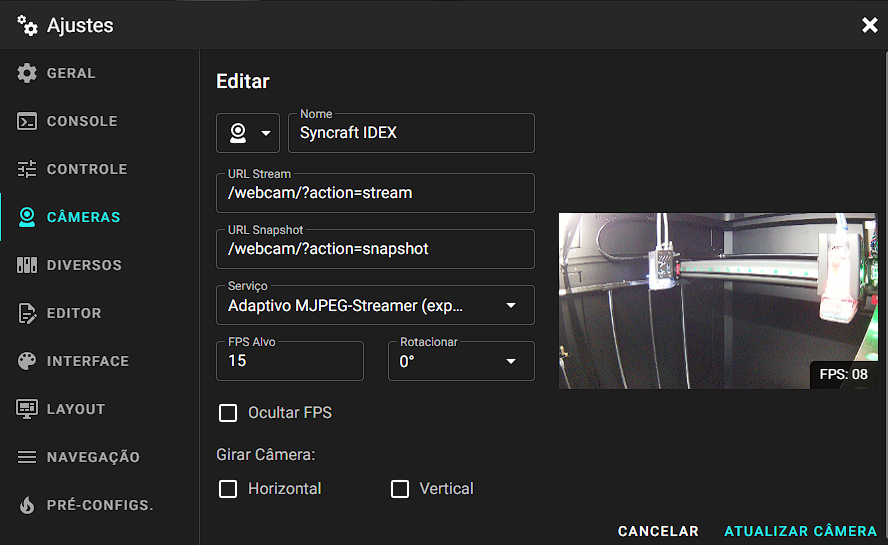

# Syncraft config

This repository contains the configuration files for Syncraft 3D printers.

## File structure

Each printer model has its own directory and `.cfg` file, both named after the model.

- Klipper configurations and macros are in the model's directory.
- Non-Klipper configurations are in `root` directory.

```
├── 
└── README.md
```

## Installation

1. Clone the repository and link it to your Klipper configuration directory:
	```bash
	cd ~
	git clone https://github.com/Syncraft-Technologies/syncraft-config.git
	ln -s ~/syncraft-config printer_data/config/syncraft-config
	```
2. Include the model's file in your main Klipper configuration (`~/printer_data/config/printer.cfg`):
	```conf
	[include syncraft-config/<model_name>.cfg]
	```
3. Check the model's `README.md` for more instructions.

### Moonraker configuration

Since Moonraker configuration allow includes, you can include the common and specific configuration files in your `~/printer_data/config/moonraker.conf` file:

```conf
[include <folders/subfolders>/moonraker.conf]
```

### Crowsnest configuration
- Instalação
	- Reference: https://crowsnest.mainsail.xyz/setup/installation
	- Inside folder `[root]/crowsnest`
		```bash
		sudo make install
		```

- Config file

	Path: `/printer_data/config/crowsnest.conf`

	```bash
	#### crowsnest.conf
	#### This is a typical default config.
	#### Also used as default in mainsail / MainsailOS
	#### See:
	#### https://github.com/mainsail-crew/crowsnest/blob/master/README.md
	#### for details to configure to your needs.


	#####################################################################
	####                                                            #####
	####      Information about ports and according URL's           #####
	####                                                            #####
	#####################################################################
	####                                                            #####
	####    Port 8080 equals /webcam/?action=[stream/snapshot]      #####
	####    Port 8081 equals /webcam2/?action=[stream/snapshot]     #####
	####    Port 8082 equals /webcam3/?action=[stream/snapshot]     #####
	####    Port 8083 equals /webcam4/?action=[stream/snapshot]     #####
	####                                                            #####
	#####################################################################
	####    RTSP Stream URL: ( if enabled and supported )           #####
	####    rtsp://<ip>:<rtsp_port>/stream.h264                     #####
	#####################################################################


	[crowsnest]
	log_path: /home/pi/printer_data/logs/crowsnest.log
	log_level: verbose  # Valid Options are quiet/verbose/debug
	delete_log: false   # Deletes log on every restart, if set to true
	no_proxy: false

	[cam 1]
	mode: camera-streamer
	enable_rtsp: false
	port: 8080
	device: /base/soc/i2c0mux/i2c@1/ov5647@36
	resolution: 1920x1080
	max_fps: 15

	# You can run the Stream Services with custom flags.
	#custom_flags:

	# Add v4l2-ctl parameters to setup your camera, see Log what your cam is capable of.
	```

- Mainsail configuration
